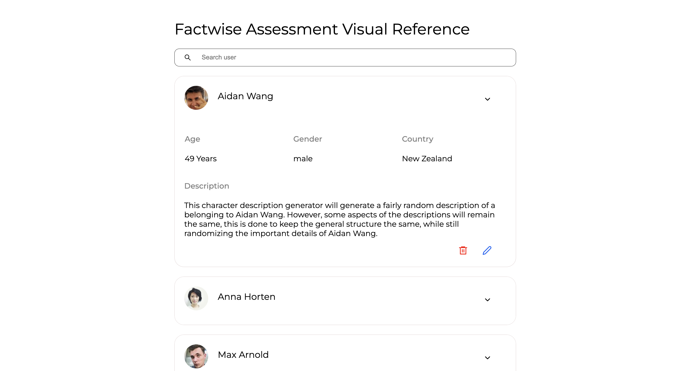

# Factwise Assessment Visual Reference


[Installation](#installation)
[Live Project](#LiveProject)
[Folder and File Structure](#files)
[Screenshot](#example)
[Contributors](#contributors)


## Installation

To use this project, follow these steps:
1. **Clone the Repository:**
   
    ```bash
   https://github.com/Aman-Sharmaa/factwise.git

2. **Navigate to the project directory**
    ```bash
   cd factwise


3. **Install the javascript dependecies using yarn package manager**
    ```bash
   npm install

4. **After the installation run the project**
    ```bash
   npm start
   ```
    
   After the yarn start application will be open on port 3000 on localhost
   ```
   http://localhost:3000

5. **If you want to deploy on server then build the application**
   ```bash
   npm run build
   ```
   It will create a build folder which will contain all static files 


## Live Project

1. **If you don't want to clone and run check online**
    ```bash
   https://factwise.amansharma.co

## Folder and File Structre

1. Folder Structure
   ```bash
   CSS Code
   factwise/src/assets/css/App.css

   Calculation Functions
   factwise/src/utils/crud.js

   JSON File
    factwise/src/json/celebrities.json

   Single Screen
   factwise/src/screens/singleScreens.js

   Main Screen
   factwise/src/app.js


   


## Screenshot


